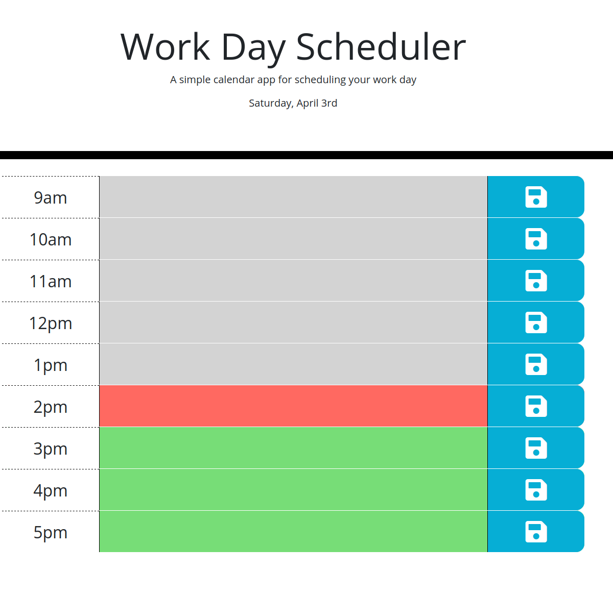

# Word Day Scheduler
## Description
This repository contains a simple calendar application that allows a user to save events for each hour of the day.

It uses *Bootstrap* in combination with limited CSS to achieve a minimalist style.

It uses *jQuery* to dynamically manipulate DOM elements.

It uses *Momentjs* to retrieve and display the current time to the user.

The UI is clean, polished and responsive to multiple screen sizes.

The current day is displayed at the top of the calendar.
Timeblocks for standard business hours are displayed.
Each timeblock is color coded to indicate whether it is in the past, present, or future.
These colors are automatically updated even when the page is left open.
The user can enter an event as text in a timeblock.
The user can click the save button for that timeblock which saves the associated event text in local storage.
The user can refresh the page and the saved events persist.

## Usage
The deployed website can be viewed here: https://dandycodes.github.io/work-day-scheduler/
## Credits
https://developer.mozilla.org/en-US/

https://www.w3schools.com/
## License
Copyright (c) DandyCodes. All rights reserved.

Licensed under the [MIT](LICENSE.txt) license.